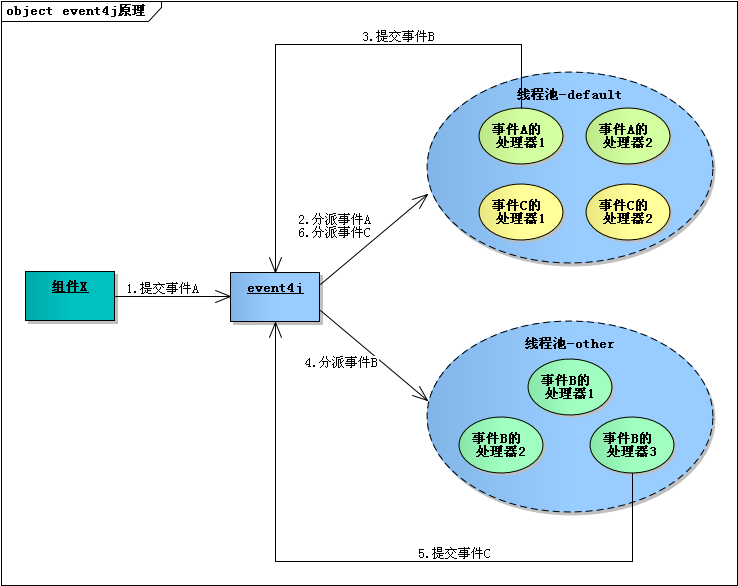

Don't call us, We'll call you （不要打给我们，我们会打给你），这是著名的`好莱坞原则`。想进入好莱坞的演艺人员，把简历提交后就只能回家等待。通过了，娱乐公司会打电话通知。没有通过，就石沉大海。如果不这样做，每天一大帮人打电话来询问，娱乐公司的电话会被打暴，整天接电话做不了其他事情。并且，许多重要的事情沟通又无法打进电话，那样的场景可以用一团糟来形容。

在平常的编程实现中，经常会见到这样的情况：客户端为了获取当前用户的新消息 ，每隔一段时间（分钟级），就向服务端发送一个请求，询问是否有消息，如果有就展示给用户，否则什么也不做。其实，绝大部分的查询请求是无效的。只有在用户做了某些操作导致一些状态发生变化而这些变化需要知会用户时。或者因为运营的需要，邀请用户参与某些活动，发送消息通知用户。但客户端不知道用户会在什么时候有新消息 ，为了尽快地将新消息展示给用户，所以只有不停地向服务端查询。日活用户量比较少时，这种使用轮询机制来获取新消息的方式是没有问题的，系统压力也不大。但当日活用户达到千万级别时，大量的无效请求会给服务端和网络带宽造成很大的压力，甚至拖垮服务端。

如果改用事件通知机制，就可以很好地解决这个问题。当用户有新消息时，服务端触发一个消息事件，由专门的消息组件来处理这个事件，将消息实时推送给客户端。这样，即可以省掉大量无效的请求，减轻服务端的压力，又可以让消息快速地到达客户端展示给用户。

`event4j`是一个实现了`事件驱动`和`异步化`的轻量级框架，可帮助我们实现以事件驱动为中心的应用，采用提交事件和分派事件的方式，使处理事务的上下游各个组件之间不直接发生交互，降低耦合，扩展方便。事件生产者不用关心这个事件有哪些消费者，它只负责向event4j提交事件。事件的消费者也不需关心这个事件是谁产生的，它只需要关注event4j分派事件给它时该如何处理。

event4j以事件对消费者进行分组管理，结构清晰，增加和删除事件的消费者非常方便。内部使用线程池，可以异步化且并行执行事件的处理，使应用的吞吐量大大提升。

简单地讲：event4j只做3件事情：
* 管理事件与消费者的关系。
* 接收提交的事件并分派给需要监听该事件的消费者。
* 提供线程池让事件的消费者异步执行。

#文档

1、[编译event4j](doc/guide/01-compile.md)。

2、[event4j入门指南](doc/guide/02-guide.md)。

3、[版本历史](doc/guide/03-history.md)。
